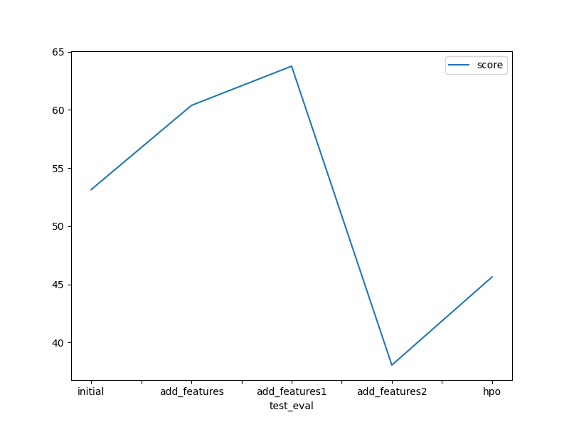
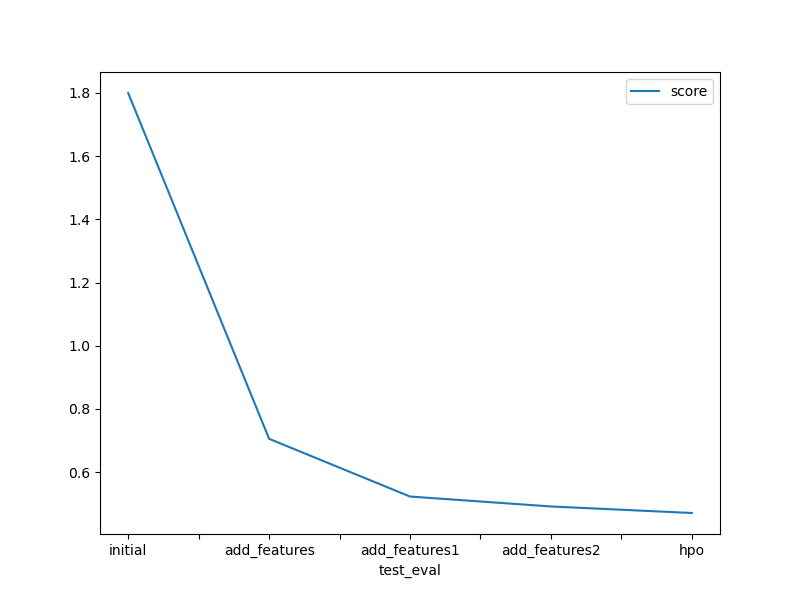

# Report: Predict Bike Sharing Demand with AutoGluon Solution
#### Hemanth Sai Teja Lingam

## Initial Training
### What did you realize when you tried to submit your predictions? What changes were needed to the output of the predictor to submit your results?
I trained a total of 5 models. Initial model was directly trained on the input data. The second,third and fourth models were trained after performing Exploratory Data Analysis(EDA) which improved the performance in kaggle. The final model was trained on the data(the data which gave better results on the default parameters of AutoGluon) and the performance of the model is increased by performing the HyperParameter search.

Since the result is count the predictions should not contain negative values and as for this reason kaggle won't accept the predictions which contain negative values. So I converted all the negative values to Zero before submitting my results.

### What was the top ranked model that performed?
The top ranked model that performed well is WeightedEnsemble_L3 with RMSE of `45.644442` and Kaggle score of `0.47071`. This model is trained on data obtained by using Exploratory Data Analysis(EDA) and model hyperparameters are optimised by performing the HyperParameter search. 

## Exploratory data analysis and feature creation
### What did the exploratory analysis find and how did you add additional features?
While Performing EDA I find
1)The features temp and atemp are almost similar they wont add any new information for the model to train. So I dropped the column atemp.
2)The features casual and registered are not there in the test data even if we train our model with those features and not providing these features while predicting does not make sense. So I dropped these features.
3)The feature datetime is split into different features like hours,day of week,months,Year I trained 3 models after extracting and what i observed is the best outcome is coming when we extract hours,year,month features from datetime.
4)The features season and weather are converted to categorical type from integer type
I found this by drawing histograms and finding correlation between features.

### How much better did your model preform after adding additional features and why do you think that is?
The kaggle performance metric Root Mean Squared Logarithmic Error is decreased by `73%` after adding addtional features and after dropping features which don't contribute much to the model training when compared to the initial model

## Hyper parameter tuning
### How much better did your model preform after trying different hyper parameters?
The kaggle performance metric Root Mean Squared Logarithmic Error is decreased by `74%` after trying different hyper parameters when compared to the intial model.

### If you were given more time with this dataset, where do you think you would spend more time?
If I were given more time with this dataset, I would like to spend more time on understanding the patterns in data and would also like to spend my time exploring different search space for HyperParameter tuning.

### Create a table with the models you ran, the hyperparameters modified, and the kaggle score.
|model|hpo1|hpo2|hpo3|score|
|--|--|--|--|--|
|initial|default|default|default|1.79978|
|add_features|default|default|default|0.70549|
|add_features1|default|default|default|0.52283|
|add_features2|default|default|default|0.49140|
|hpo|RF:('n_estimators':100,'max_depth':10,'criterion':'squared_error')|CAT':('iterations':100,'learning_rate':0.01)|hyperparamters_kwargs:('num_trails':10,'searcher':'random','scheduler': 'local') |0.47071| 

### Create a line plot showing the top model score for the three (or more) training runs during the project.

TODO: Replace the image below with your own.

### Create a line plot showing the top kaggle score for the three (or more) prediction submissions during the project.

TODO: Replace the image below with your own.

## Summary
In this project I spend time by performing EDA to find and understand patterns in the dataset and later done preprocessing and feature Engineering. I used AutoGluon default parameters initially to train and validated the model on the test data. At the End I optimised the Hyperparameters by performing Hyperparameter search.
As a result I observed that How EDA,Preprocessing an Feature Engineering makes our raw data more valuable and How Hyperparameter optimisation improves the model performance by exploring the search space defined.
